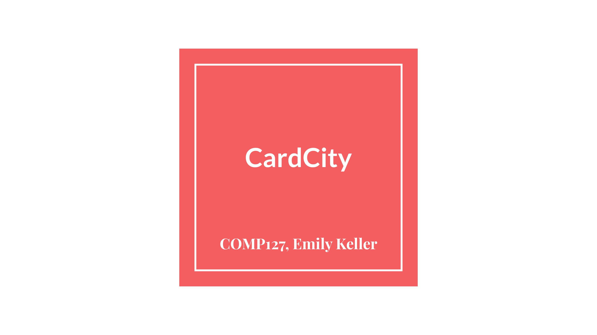
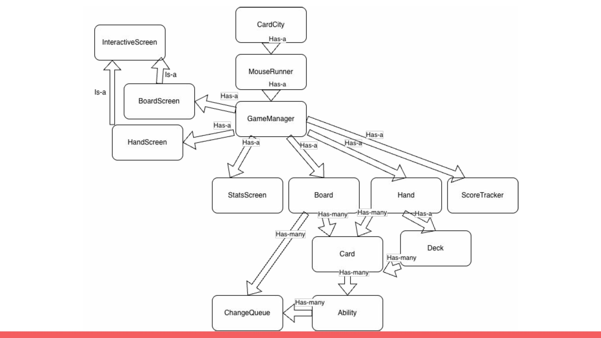
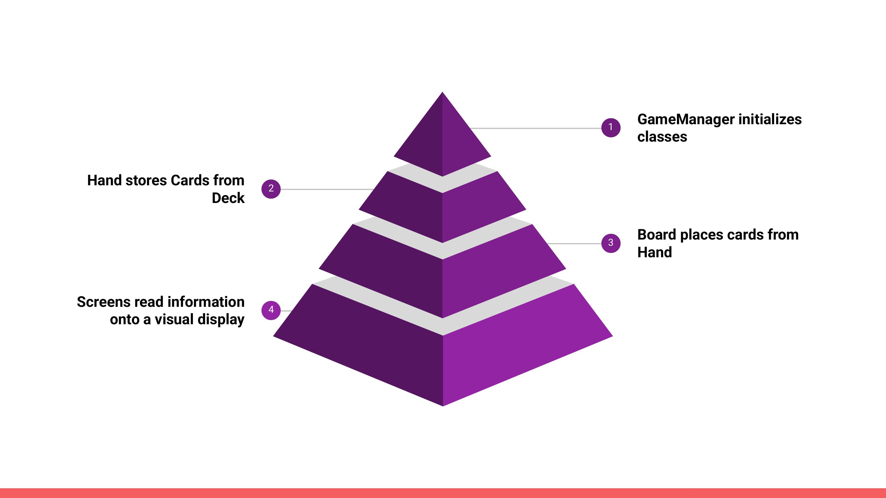
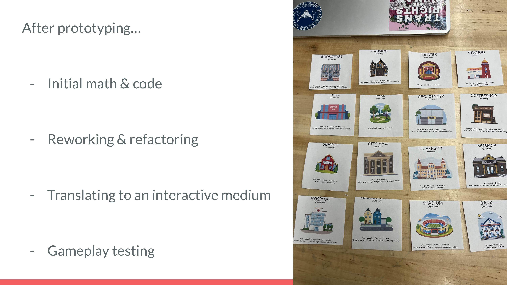
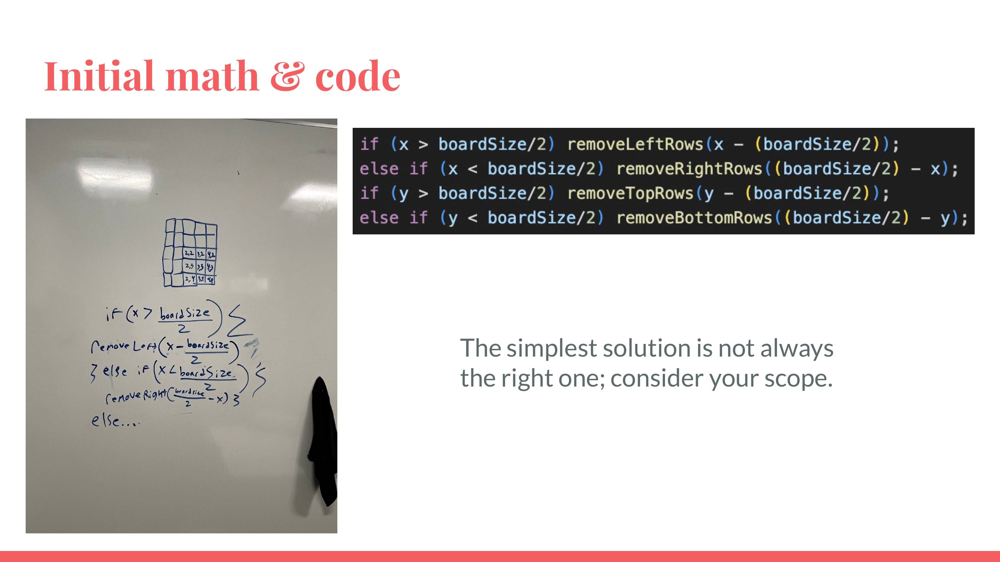
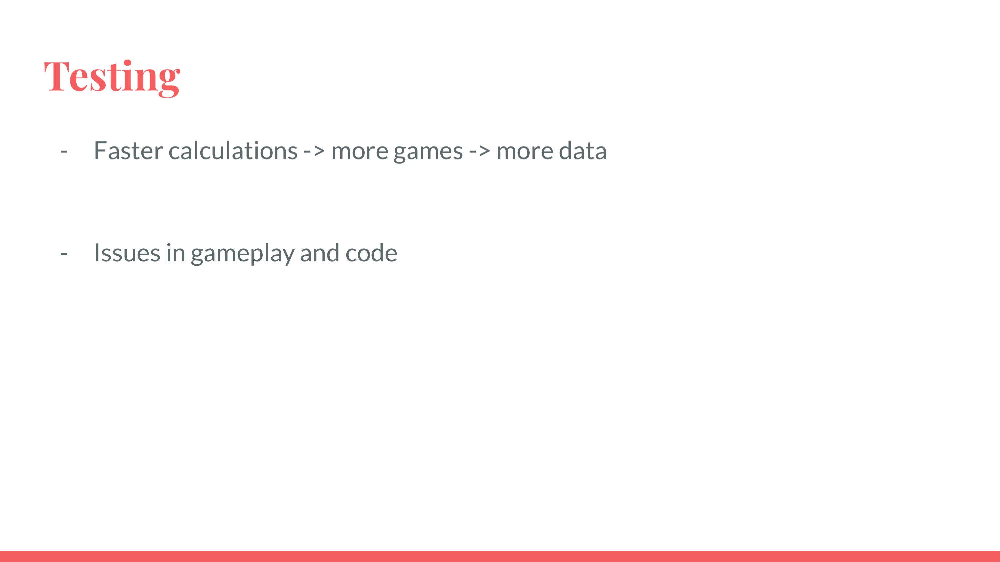

# CardCity

## Team Members
- Emily Keller

## Abstract
CardCity is a simple card game in which you build a simulated city, managing your population, economy, and overall happiness levels while trying to avoid falling into debt.

## To Run the Program
To start the game, all you need to do is run the “main” method inside the CardCity class. That will handle everything else. The most important part of the game is knowing how to play and the controls.

## The Controls
The game can be played entirely with the mouse or trackpad. The game will open three windows.  The “Stats!” window is for viewing, and the other two are interactive. 
- To draw two cards (up to a maximum of 6), click on an empty space in the “Hand!” window. After drawing two cards, you must place a card onto the board before drawing again.
- To place a card, click on an empty space in the “Board!” window; your selected space is indicated by the circular cursor. In order to place a card, make sure you have a card selected.
- To select a card, click on any card in the “Board!” or “Hand!” window. The selected card’s details will appear in the “Stats!” window.

## The Rules
[Click here](https://docs.google.com/document/d/1kTQqoPUOeiTYOyPAKrsAQBfg8MBgd8o2JUXtb9ZWSJg/edit?usp=sharing) to read the rules of the game.

## Known Issues
All major bugs and errors have been thoroughly tested for and fixed. There are only two known issues: Firstly, due to the game having multiple windows, sometimes users must click multiple times for the game to register their attempted action. Secondly, if users resize the "Stats!" window to be too small, some text may overlap.

## Societal Impact
Firstly, with consideration for both artists and the environment, no generative AI was used in the making of the game. That being said, there is some controversy to the game itself. The game’s messages of cities, debt, and capitalism could be harmful to people with real-world struggles. However, it is just a game, so there are not many malicious and oppressive ways to abuse the software.

## Live Demo
[Click here](https://youtu.be/m_mnW-XsXkI) to watch a live demonstration and breakdown of the game and the creation process.

